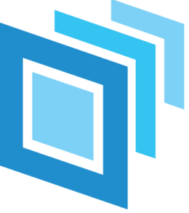

  

<h1 align="center"> StudioTools </h1>

  
  
  
  

   

  

---

**Studiotools** is an open-source **USD** based pipeline tool for **VFX and CG Productions**.  

---

## 📬 Contact & Info

This repository is maintained by **Christopher Hosken**.

- 📧 Email: [hoskenchristopher@gmail.com](mailto:hoskenchristopher@gmail.com)  
- 🔗 LinkedIn: [christopher-hosken](https://www.linkedin.com/in/christopher-hosken/)  

---
